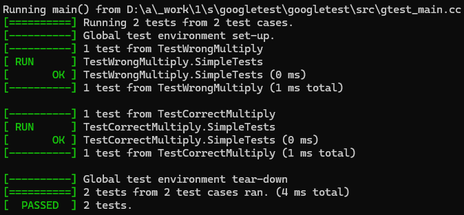
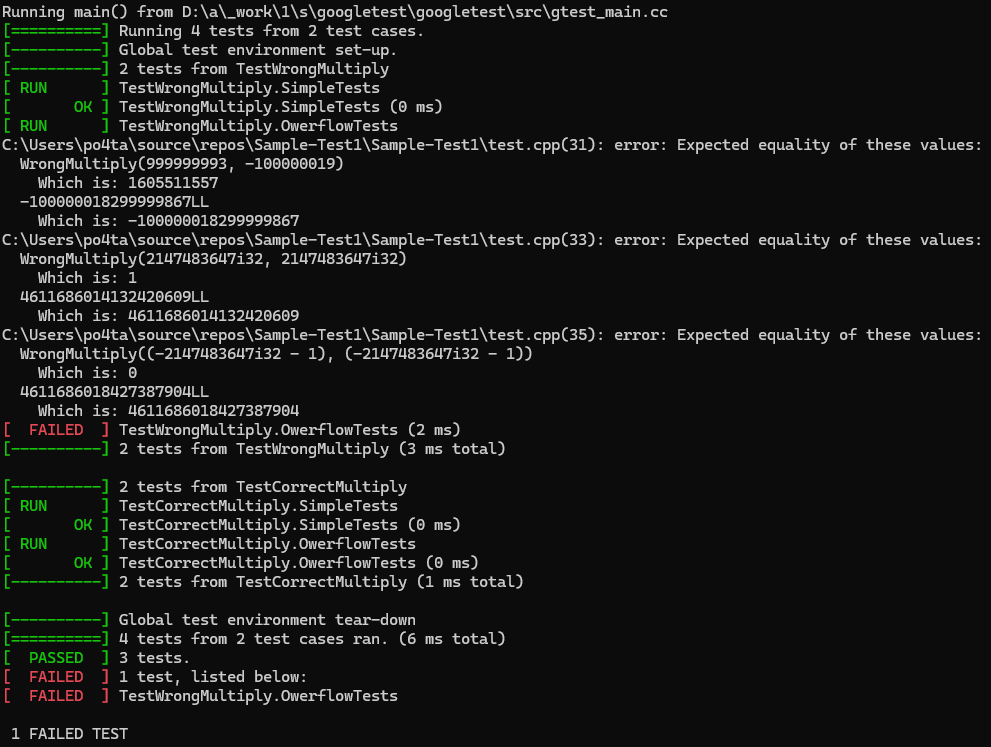

# Создание unit-тестов на примере фреймворка GTest

Здесь мы познакомимся с библиотекой `GoogleTest` и научимся писать базовые модульные тесты на примере макросов из этого фреймворка. Про другие возможности тестирования можно почитать [здесь](https://google.github.io/googletest/).

## Понятие юнит-тестов

**Модульное тестирование**, или **юнит-тестирование** (англ. _unit testing_) — процесс в программировании, позволяющий проверить на корректность отдельные модули исходного кода программы.

Идея состоит в том, чтобы писать тесты для каждой нетривиальной функции или метода. Это позволяет достаточно быстро проверить, не привело ли очередное изменение кода к регрессии, то есть к появлению ошибок в уже оттестированных местах программы, а также облегчает обнаружение и устранение таких ошибок.

## Первое знакомство с GTest

Рассмотрим программу, использующую gtest:
```cpp
#include <gtest/gtest.h>

TEST(TestGroupName, Subtest_1) {
    ASSERT_TRUE(1 == 1);
}

TEST(TestGroupName, Subtest_2) {
    ASSERT_FALSE('b' == 'b');
    std::cout << "continue test after failure" << std::endl;
}

int main(int argc, char **argv) {
    ::testing::InitGoogleTest(&argc, argv);
    return RUN_ALL_TESTS();
}
```

Как видим, фреймворк активно использует макросы. В макросе `TEST` первый аргумент в скобках означает название группы тестов, объединенных общей логикой. Второй аргумент — название конкретного теста в подгруппе.

`ASSERT_TRUE` и `ASSERT_FALSE` — тоже макросы, реализующие т.н. "утверждения", которые будет проверять фреймворк.

Утверждения бывают:
1. успешные (success);
2. неудачные, но нефатальные (nonfatal failure);
3. неудачные, фатальные (fatal failure).

Отличия второго от третьего варианта можно понять, взглянув на код теста выше. Макросы `ASSERT_FALSE` и `ASSERT_TRUE` прерывают выполнение теста (fatal failure) и идущая следом команда уже не будет вызвана.

Такое же поведение можно наблюдать у макроса `ASSERT_EQ(param1, param2)` сравнивающего два своих аргумента на равенство:
```cpp
TEST(TestGroupName, Subtest_1) {
  ASSERT_EQ(1, 2);
  std::cout << "continue test\n"; // не будет выведено на экран
}
```

По-другому работает макрос `EXPECT_EQ` — в случае неудачи выполнение кода после него продолжится:
```cpp
TEST(TestGroupName, Subtest_1) {
  EXPECT_EQ(1, 2); // логи покажут тут ошибку
  cout << "continue test\n"; // при этом будет выведено на экран 
                             // данное сообщение
}
```

Для `ASSERT_` и `EXPECT_` можно использовать следующие окончания:
- EQ — Equal
- NE — Not Equal
- LT — Less Than
- LE — Less than or Equal to
- GT — Greater Than
- GE — Greater than or Equal to

Окончаний на самом деле больше, т.к. при тестировании сравнивают не только целые числа. Для вещественных чисел, строк, предикатов примеры окончаний можно подглядеть [здесь](https://habr.com/ru/post/119090/).

## Написание юнит-тестов в Visual Studio

Перед написанием тестов нужно настроить необходимые проекты и библиотеки в самой Visual Studio. [Тут](https://learn.microsoft.com/ru-ru/visualstudio/test/writing-unit-tests-for-c-cpp?view=vs-2022) можно почитать как это сделать.

Теперь после знакомства с некоторыми из макросов и настройки проекта мы можем перейти к написанию тестов.

### Описание функций для тестирования

Рассмотрим две функции, которые, на первый взгляд, делают одно и то же: выполняют умножение двух чисел типа `int32_t`:

```cpp
int32_t WrongMultiply(int32_t a, int32_t b) { // 1
    return a * b;
}

int64_t CorrectMultiply(int32_t a, int32_t b) { // 2
    return static_cast<int64_t>(a) * b;
}
```

### Написание и запуск тестов

Попробуем написать простые тесты к этим двум функциям с помощью макроса `EXPECT_EQ`:

```cpp
namespace SimpleMultiplyTests {

TEST(TestWrongMultiply, SimpleTests) {
    EXPECT_EQ(WrongMultiply(0, 1), 0);
    EXPECT_EQ(WrongMultiply(1, 1), 1);
    EXPECT_EQ(WrongMultiply(-1, 1), -1);
    EXPECT_EQ(WrongMultiply(-1, -1), 1);
    EXPECT_EQ(WrongMultiply(6, 7), 42);
    EXPECT_EQ(WrongMultiply(15, 4), 60);
}

TEST(TestCorrectMultiply, SimpleTests) {
    EXPECT_EQ(CorrectMultiply(0, 1), 0);
    EXPECT_EQ(CorrectMultiply(1, 1), 1);
    EXPECT_EQ(CorrectMultiply(-1, 1), -1);
    EXPECT_EQ(CorrectMultiply(-1, -1), 1);
    EXPECT_EQ(CorrectMultiply(6, 7), 42);
    EXPECT_EQ(CorrectMultiply(15, 4), 60);
}

} // namespace SimpleMultiplyTests
```

При запуске этих тестов видим, что обе функции их проходят:



Теперь рассмотрим краевые случаи. Так как мы работаем с типом
`int32_t`, то может возникнуть такой случай, что при умножении двух чисел этого типа мы получим переполнение(например, 47432 и 56734):

```cpp
namespace OwerflowMultiplyTests {

TEST(TestWrongMultiply, OwerflowTests) {
    EXPECT_EQ(CorrectMultiply(47432, 56734),
              2691007088LL);
    EXPECT_EQ(WrongMultiply(999999993, -100000019),
              -100000018299999867LL);
    EXPECT_EQ(WrongMultiply(INT32_MAX, INT32_MAX),
              4611686014132420609LL);
    EXPECT_EQ(WrongMultiply(INT32_MIN, INT32_MIN),
              4611686018427387904LL);
}
TEST(TestCorrectMultiply, OwerflowTests) {
    EXPECT_EQ(CorrectMultiply(47432, 56734),
              2691007088LL);
    EXPECT_EQ(CorrectMultiply(999999993, -100000019),
              -100000018299999867LL);
    EXPECT_EQ(CorrectMultiply(INT32_MAX, INT32_MAX),
              4611686014132420609LL);
    EXPECT_EQ(CorrectMultiply(INT32_MIN, INT32_MIN),
              4611686018427387904LL);
}

} // namespace OwerflowMultiplyTests
```

Результат работы программы вы можете видеть ниже:



Как видно, функция `WrongMultiply` не прошла краевые тесты. Из этого следует, что при реализации этой функции мы не учли переполнение. Об этом даже подсказывают предупреждения при сборке этого проекта.

Обратите внимание на то, как решена проблема с переполнением в функции `CorrectMultiply`. Во-первых, возвращаемое значение у функции `int64_t` вместо `int32_t`. Во-вторых, мы здесь используем оператор приведения типа только лишь для **одного множителя**: `static_cast<int64_t>(a) * b`. Если бы мы написали `staic_cast<int64_t>(a * b)`, то проблема бы не решилась: у нас бы сначала выполнилась операция умножения с переполнением, а только потом результат был бы приведён к типу `int64_t`.